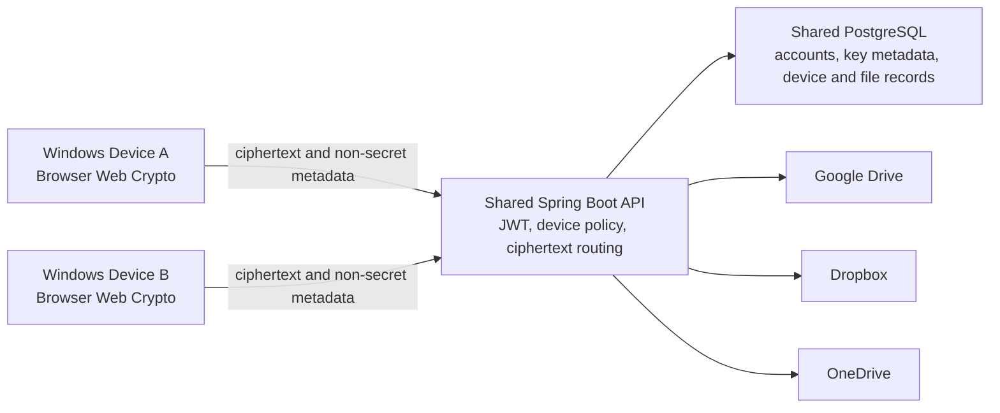

# StealthSync

StealthSync is a web-based client-side file encryption application for Google Drive, Dropbox, and OneDrive. Files are encrypted in the browser before upload and decrypted in the browser after download, so the cloud providers and StealthSync backend handle ciphertext rather than plaintext file contents.

## Current FYP Baseline

- Real OAuth connections for Google Drive, Dropbox, and OneDrive.
- Browser-side AES-GCM encryption and decryption.
- AES-128 for Free customers and AES-256-GCM for customers with an active Premium subscription.
- Password-derived encryption keys using PBKDF2-HMAC-SHA256 with 310,000 iterations and a per-key 16-byte salt.
- Versioned, provider-neutral `SSENCV2` encrypted envelopes with encrypted file metadata and random `.ssenc` cloud object names.
- Premium multi-device access for up to five active devices; Free accounts are limited to one active device.
- Account recovery phrases for account login recovery only. They do not recover an encryption-key password or decrypt files.
- A browser-local rule-based privacy warning and explainable rule-based anomaly scoring for administrator security logs.

The web application is the current validation target. Legacy server-side encryption and desktop packaging code remains only for compatibility and is not the primary FYP workflow.

## Architecture



The Key Password, derived raw key, plaintext file, original filename, and decrypted result are kept on the active browser device during the V2 workflow. The backend stores synchronized non-secret key metadata, including the salt, algorithm, KDF version, fingerprint, and password verifier. OAuth access and refresh tokens are encrypted before database storage.

## Multi-device Workflow

1. Device A opens the shared StealthSync URL and signs in to a Premium account.
2. Device A connects a cloud provider through that provider's official OAuth page, creates an encryption key, and uploads an encrypted file.
3. Device B opens the same StealthSync URL and signs in to the same account.
4. Device B automatically sees the synchronized cloud link, encryption-key metadata, and encrypted file list.
5. Device B enters the same Key Password to derive the key locally and decrypt the downloaded ciphertext.

Device B does not need Java, Node.js, PostgreSQL, OAuth application credentials, environment variables, or an exported key package. OAuth application registration and server secrets are one-time deployment responsibilities, not end-user setup.

## Project Layout

- `Back-end/` — Spring Boot 3.2.5 API, provider adapters, authentication, subscriptions, device enforcement, persistence, and security logs.
- `Front-end/` — React 19 and Vite 8 web client, Web Crypto V2, customer pages, and administrator pages.
- `scripts/` — local startup, database initialization, and packaging helpers.
- `Dockerfile`, `docker-compose.production.yml`, `.env.production.example` — shared deployment template without real secrets.

## Development Prerequisites

| Component | Project version |
| --- | --- |
| Java | 21 |
| Spring Boot | 3.2.5 |
| Maven | 3.9.x |
| PostgreSQL | 16 recommended |
| Node.js | 24.x recommended |

## Local Development

Create the PostgreSQL database once:

```powershell
psql -U postgres -d postgres -f scripts/create_stealthsync_database.sql
```

Start the backend and Vite frontend from the repository root:

```powershell
.\scripts\start-web-demo.ps1
```

The script securely prompts for the local PostgreSQL password when `DB_PASSWORD` is not already set. It also imports existing Google Drive, Dropbox, and OneDrive OAuth settings from Windows User environment variables without printing secret values.

Open `http://localhost:5173/`. Stop the local services with:

```powershell
.\scripts\start-web-demo.ps1 -Stop
```

## One-time OAuth Developer Configuration

Register these local callback URLs in the corresponding provider developer consoles:

```text
http://localhost:8080/cloud-storage/google-drive/callback
http://localhost:8080/cloud-storage/dropbox/callback
http://localhost:8080/cloud-storage/onedrive/callback
```

Configure the matching environment variables on the backend host:

```text
GOOGLE_DRIVE_CLIENT_ID
GOOGLE_DRIVE_CLIENT_SECRET
GOOGLE_DRIVE_REDIRECT_URI
DROPBOX_CLIENT_ID
DROPBOX_CLIENT_SECRET
DROPBOX_REDIRECT_URI
ONEDRIVE_CLIENT_ID
ONEDRIVE_CLIENT_SECRET
ONEDRIVE_REDIRECT_URI
ONEDRIVE_TENANT
```

Never commit OAuth secrets, database passwords, JWT secrets, OAuth state secrets, access tokens, refresh tokens, Key Passwords, or a real `.env.production` file.

## Shared Deployment

For a true two-Windows-device demonstration, both devices must use the same deployed StealthSync backend and database. Copy `.env.production.example` to `.env.production` on the server, replace every placeholder, register the production HTTPS callback URLs with all three providers, and start the deployment with:

```powershell
docker compose -f docker-compose.production.yml up --build -d
```

The deployment must use HTTPS and strong independent values for `DB_PASSWORD`, `JWT_SECRET`, `OAUTH_STATE_SECRET`, and `VAULT_SERVER_SECRET`. The `.env.production` file is ignored by Git.

## Test Accounts

These accounts are seeded for local course-project testing only:

| Role | Username | Email | Password |
| --- | --- | --- | --- |
| Administrator | `admin` | `admin@stealthsync.com` | `Admin@123` |
| Free customer | `testuser` | `testuser@stealthsync.com` | `User@123` |
| Premium customer | `PremiumUser` | `user@stealthsync.com` | `User@1234` |

Do not reuse these credentials in a public deployment.

## Automated Verification

Run the backend tests:

```powershell
cd Back-end
mvn test
```

Run the frontend security tests and production build:

```powershell
cd Front-end
npm test
npm run build
```

Current verified baseline on 28 July 2026:

- Backend: 121 tests passed.
- Frontend crypto/privacy/network-boundary tests: 7 passed.
- TypeScript and Vite production build: passed.
- Real Google Drive, Dropbox, and OneDrive OAuth/upload/list/wrong-password/correct-decrypt/delete flow: passed locally.
- Premium multi-device flow: passed with two independent browser profiles; final evidence on two physical Windows devices is still required.

## Security Terminology

- Describe the main workflow as **client-side encryption** or a **zero-knowledge-style architecture**, not as formally proven absolute zero knowledge.
- Describe the Privacy Scanner and administrator anomaly detector as **explainable rule-based detection**, not as a trained machine-learning model.
- Describe Recovery Phrase as **account login recovery only**.
- Describe Premium multi-device as synchronized non-secret key metadata plus local key derivation from the same Key Password; no key-package export/import is used.
