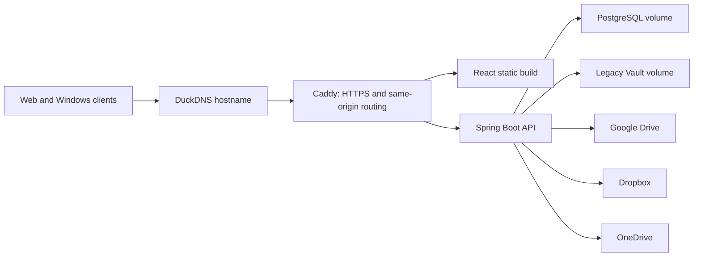

# StealthSync Azure Production Deployment

This is the primary zero-cost production topology for the FYP release. It runs
independently from the development Windows computer, Docker Desktop, and Dev
Tunnel.

## Architecture



The browser uses only `https://<YOUR_DUCKDNS_DOMAIN>/`. Caddy serves the React
build and reverse-proxies the project's established API paths to Spring Boot.
This same-origin design avoids a production cross-origin dependency.

GitHub Pages hosts only the public Marketing Website. It does not host login,
OAuth, encryption metadata, the API, or PostgreSQL.

## Files

- `docker-compose.prod.yml` - PostgreSQL, backend, frontend asset publisher, and Caddy.
- `Caddyfile` - HTTPS, SPA fallback, security headers, and API routing.
- `.env.production.example` - variable names and non-secret placeholders.
- `update-production.sh` - repeatable fast-forward deployment from `main`.
- `update-duckdns.sh` - safe DuckDNS public-IP refresh.
- `HUMAN_SETUP_CHECKLIST.md` - Azure, DNS, OAuth, GitHub, and acceptance steps.

## First VM Bootstrap

Use an Ubuntu VM on Azure. The deployed FYP instance uses the `azureuser`
account; the commands also work for another non-root maintenance account.

```bash
sudo apt-get update
sudo apt-get install -y ca-certificates curl git ufw

sudo install -m 0755 -d /etc/apt/keyrings
sudo curl -fsSL https://download.docker.com/linux/ubuntu/gpg \
  -o /etc/apt/keyrings/docker.asc
sudo chmod a+r /etc/apt/keyrings/docker.asc

. /etc/os-release
echo "deb [arch=$(dpkg --print-architecture) signed-by=/etc/apt/keyrings/docker.asc] https://download.docker.com/linux/ubuntu ${VERSION_CODENAME} stable" \
  | sudo tee /etc/apt/sources.list.d/docker.list >/dev/null

sudo apt-get update
sudo apt-get install -y docker-ce docker-ce-cli containerd.io \
  docker-buildx-plugin docker-compose-plugin
sudo usermod -aG docker "$USER"
```

Log out and reconnect once so the Docker group membership applies. Then clone
the repository and prepare the private environment file:

```bash
git clone https://github.com/Kasimer-0/CSIT321-FY-Project-Seamless-File-Encryption-App-for-Cloud-.git \
  "$HOME/stealthsync"
cd "$HOME/stealthsync"
cp deploy/production/.env.production.example deploy/production/.env.production
chmod 600 deploy/production/.env.production
nano deploy/production/.env.production
```

Generate each application secret independently. Run this command four times
and store the results in a private password manager before entering them in the
VM-only file:

```bash
openssl rand -base64 48
```

Do not place the populated file in GitHub, Google Drive, screenshots, a source
archive, or a support message.

## Firewall And DNS

The Azure Network Security Group must allow inbound TCP 22, 80, and 443. Apply
the matching VM firewall rules:

```bash
sudo ufw allow OpenSSH
sudo ufw allow 80/tcp
sudo ufw allow 443/tcp
sudo ufw --force enable
sudo ufw status
```

After creating the DuckDNS subdomain and entering its token in the private env
file, update the record:

```bash
cd "$HOME/stealthsync"
sh deploy/production/update-duckdns.sh
getent hosts stealthsync-fyp.duckdns.org
```

Replace the example hostname with the actual `PUBLIC_DOMAIN`. DNS must resolve
to the VM before starting Caddy. To refresh DuckDNS every six hours:

```bash
(crontab -l 2>/dev/null; echo '17 */6 * * * cd "$HOME/stealthsync" && /bin/sh deploy/production/update-duckdns.sh >> "$HOME/.local/state/stealthsync/duckdns.log" 2>&1') | crontab -
```

Adjust the home path if a different VM user is used.

## Start And Verify

Register the final OAuth callback URLs first, then deploy:

```bash
cd "$HOME/stealthsync"
docker compose \
  --env-file deploy/production/.env.production \
  -f deploy/production/docker-compose.prod.yml \
  config --quiet

docker compose \
  --env-file deploy/production/.env.production \
  -f deploy/production/docker-compose.prod.yml \
  up -d --build

docker compose \
  --env-file deploy/production/.env.production \
  -f deploy/production/docker-compose.prod.yml \
  ps

curl --fail --silent --show-error \
  "https://<YOUR_DUCKDNS_DOMAIN>/actuator/health"
```

Expected health response:

```json
{"status":"UP"}
```

Caddy automatically requests and renews the public TLS certificate after the
hostname resolves and ports 80/443 are reachable.

## Repeatable Updates

Manual update from the VM:

```bash
cd "$HOME/stealthsync"
bash deploy/production/update-production.sh
```

The script refuses to overwrite tracked VM changes, fast-forwards to
`origin/main`, validates Compose, rebuilds changed images, and waits for the
public health endpoint. GitHub Actions invokes the same script with the exact
validated commit SHA.

Useful operator commands:

```bash
# Status
docker compose --env-file deploy/production/.env.production \
  -f deploy/production/docker-compose.prod.yml ps

# Recent service logs (never paste them into public reports without review)
docker compose --env-file deploy/production/.env.production \
  -f deploy/production/docker-compose.prod.yml logs --tail=100 backend caddy

# Restart without deleting persistent data
docker compose --env-file deploy/production/.env.production \
  -f deploy/production/docker-compose.prod.yml restart

# Stop containers while retaining all named volumes
docker compose --env-file deploy/production/.env.production \
  -f deploy/production/docker-compose.prod.yml down
```

Never add `-v` to `docker compose down` in production unless permanent deletion
of PostgreSQL, Vault, Caddy certificates, and frontend assets is intentional.

## Backups

Create a private directory outside the repository:

```bash
mkdir -p "$HOME/stealthsync-backups"
chmod 700 "$HOME/stealthsync-backups"
timestamp="$(date -u +%Y%m%dT%H%M%SZ)"

docker compose --env-file deploy/production/.env.production \
  -f deploy/production/docker-compose.prod.yml \
  exec -T postgres sh -c 'pg_dump -Fc -U "$POSTGRES_USER" "$POSTGRES_DB"' \
  > "$HOME/stealthsync-backups/postgres-${timestamp}.dump"

docker compose --env-file deploy/production/.env.production \
  -f deploy/production/docker-compose.prod.yml stop backend
docker run --rm \
  -v stealthsync-production_vault-data:/source:ro \
  -v "$HOME/stealthsync-backups:/backup" \
  alpine:3.22 \
  tar -czf "/backup/vault-${timestamp}.tar.gz" -C /source .
docker compose --env-file deploy/production/.env.production \
  -f deploy/production/docker-compose.prod.yml start backend

sha256sum "$HOME/stealthsync-backups/"*"${timestamp}"* \
  > "$HOME/stealthsync-backups/SHA256SUMS-${timestamp}.txt"
```

Keep an encrypted off-VM copy of the database dump, Vault archive, and the
production secrets. Existing encrypted OAuth credentials require the same
`TOKEN_ENCRYPTION_SECRET`; legacy wrapped vault data requires the same
`VAULT_SERVER_SECRET`.

## End Users Versus Operators

End users only open the production HTTPS URL or install the Windows client,
then log in and connect their provider account. They do not install or start
Java, Maven, PostgreSQL, Node.js, Docker, Caddy, or this deployment script.

This directory is for the project team member responsible for the Azure VM.
Local source development remains documented in the root `README.md`.
